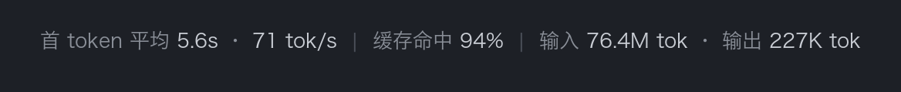

# dsh-statusbar-config

**English** | [中文](./README.md)

A [DeepSeek Harness](https://github.com/deepseek-ai/deepseek-harness) web UI plugin that makes the conversation statistics row below the composer **fully template-driven** — JS template-literal syntax `${variable}`, write whatever you want, applies live.

[](https://github.com/MannixHu/dsh-statusbar-config)
[](./LICENSE)

<p align="center"></p>

It shadows the shipped `stats` entry in the `conversation.composer.dock` slot (lower priority wins the cell) with the same data and precision as the official StatsLine; the display content is entirely your template.

## Template variables

| Variable | Meaning | Example |
|---|---|---|
| `${ttft}` | average time to first token, seconds (bare number) | `5.8` |
| `${tps}` | decode throughput, tok/s (bare number) | `69` |
| `${cache}` | cache hit percent (no `%` sign) | `93` |
| `${input}` | billed input tokens (compact) | `63.7M` |
| `${output}` | output tokens (compact) | `178K` |
| `${turns}` / `${steps}` | turns / steps | `12` / `34` |
| `${llm}` / `${tool}` | cumulative LLM / tool time (unit included) | `3m12s` |

Units, separators, and any literal text are yours to write in the template; unknown variables stay verbatim; variables without data yet render empty.

## Install

```bash
dsh plugin --profile web add github:MannixHu/dsh-statusbar-config
```

Then restart `dsh web` (the loader graph is frozen at process start).

## Configure

Two equivalent ways:

- **In the UI** — Settings → Plugins → *Status bar template* card: click a variable chip to insert at the cursor, Enter to save, applies immediately (recommended).
- **In `~/.dsh/settings.yaml`** — the `status-bar-config` namespace:

```yaml
status-bar-config:
  enabled: true
  template: 'TTFT avg ${ttft}s · ${tps} tok/s | Cache ${cache}% | In ${input} tok · Out ${output} tok'
```

renders:

```
TTFT avg 5.8s · 69 tok/s | Cache 93% | In 63.7M tok · Out 178K tok
```

Empty `template` = default statistics row (the full shipped segments); `enabled: false` hides the row. The 0.1 per-segment toggles are superseded by the template — legacy yaml boolean keys are ignored; switch to `template` after upgrading.

## Migration

**From the 0.1 segment toggles**: 0.2 replaces them with the template. Legacy boolean keys in yaml are ignored — rewrite your toggle combination as one `template:` line; for example, with only ttft/throughput/cacheHit/input/output on:

```yaml
status-bar-config:
  enabled: true
  template: 'TTFT avg ${ttft}s · ${tps} tok/s | Cache ${cache}% | In ${input} tok · Out ${output} tok'
```

**From leonardoxr/dsh-status-bar-config**: this plugin keeps the same `status-bar-config` namespace, so your existing settings section loads as-is. That plugin's inject list depends on `@deepseek-ai/dsh-client-runtime` / `dsh-client-ui-slots`, which the 0.1.2-alpha reorganization removed; this plugin is rewritten against the post-alpha package graph and needs no inject patch.

## Compatibility

- Requires DSH `0.1.2-alpha`+ (client graph deps are only packages alive in the alpha reorganization: `dsh-client-locale`, `dsh-client-ui-renderer`, `dsh-client-ui-settings`, `dsh-client-ui-conversation`).
- The built bundle (`lib/`) is committed, so installing from git needs no build step and no `onlyBuiltDependencies` entry.

## Build from source

```bash
pnpm install
pnpm check   # typecheck + build (lib/index.js host half, lib/client.js browser half)
```

## License

MIT
